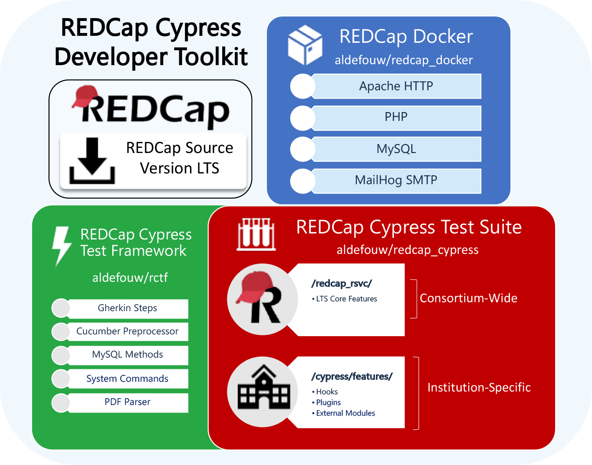

# REDCap Cypress Developer Toolkit

The REDCap Cypress Developer Toolkit provides an automated framework for validating REDCap’s core functionality. Automated testing helps ensure system integrity, reduces manual testing burden, and supports institutions in meeting regulatory compliance requirements (e.g., 21 CFR Part 11).

The toolkit was originally developed by the RSVC Automated Testing Subcommittee (ATS) and is now maintained by Vanderbilt University Medical Center (VUMC). RSVC continues to contribute to updates and actively uses the toolkit for REDCap validation efforts.

This repository includes scripts to download all the necessary components for a developer to begin developing automated feature tests on their developer machine.  This toolkit is based on the industry-standard [Cypress Testing Framework](https://github.com/cypress-io/cypress/blob/develop/README.md).

If you'd like to participate in our ongoing automation efforts, see our [Contribution Guidelines](CONTRIBUTING.md).


## What is Automated Testing?

Automated testing involves executing pre-scripted tests against a REDCap instance to validate that core functionality works as expected. These tests:
  - Ensure system stability after software updates
  - Reduce redundant manual testing for common workflows
  - Support regulatory compliance efforts by providing structured validation

Tests are executed in a controlled test environment and should never be run on a production system, as they modify project data.


## How Are Automated Tests Selected?

Not all REDCap features are suitable for automation. When determining which features should be tested automatically, the RSVC considers:

  - Reproducibility – Can the test be executed consistently across institutions?
  - Regulatory Impact – Does the feature support compliance with 21 CFR Part 11?
  - Complexity – Is automation feasible, or does the feature require manual review?
  - Test Stability – Does the test produce reliable results across different REDCap versions?

For each REDCap release, RSVC reviews system changes and determines which features should be tested manually and which can be automated.


# Windows Tutorial Video

[](https://youtu.be/cQhp9Om8Cgk "Windows Tutorial Video")

# macOS Tutorial Video

[](https://youtu.be/AyR-YFNrlZI "macOS Tutorial Video")

# Overview

- [Software Prerequisites](#software-prerequisites)
- [Create SSH Key](#ssh-key-in-github-account)
- [Developer Toolkit Installation Instructions](#developer-toolkit-installation-instructions)
- [Changing REDCap Versions](#changing-redcap-versions)
- [Start REDCap Test Environment](#start-redcap-test-environment)
- [Configure & Start Cypress](#configure--start-cypress)
- [Contribute to Feature Tests](#contribute-to-feature-tests)
- [Update Repositories](#update-repositories)
- [Rebuild Docker Containers](#rebuild-docker-containers)



### Software Prerequisites:

A developer needs the following software on their machine before installing this Developer Toolkit.

- Git (version control)

  - [for Windows](https://gitforwindows.org/)
  - for macOS options (choose one)
    - [Homebrew](https://brew.sh/): `brew install git`
    - [MacPorts](https://www.macports.org/): `sudo port install git`
    - [Xcode](https://developer.apple.com/xcode/) - shipped as a binary package
  - [for Linux](https://git-scm.com/download/linux)

- [Docker Desktop](https://www.docker.com/products/docker-desktop/) - available for Windows, macOS, Linux
- [Node.js](https://nodejs.org/en/download) - available for Windows, macOS, Linux
- [VS Code](https://code.visualstudio.com/) - This is the recommended [IDE](https://en.wikipedia.org/wiki/Integrated_development_environment), but others may be used as well (e.g. PhpStorm).  Be mindful that **Visual Studio Code** is most often referred to as **VS Code** in part to distinguish it from a different application simply called **Visual Studio** which we do not use.
- [Cucumber Extension for VS Code by cucumber.io](https://marketplace.visualstudio.com/items?itemName=CucumberOpen.cucumber-official)

### SSH Key in GitHub Account

You will need to place your public key on GitHub for this process to work correctly.

To generate a key on your local machine, most of time the command is:

```
ssh-keygen
```

Please consult GitHub's SSH documentation for more information:
[GitHub SSH Key Instructions](https://docs.github.com/en/authentication/connecting-to-github-with-ssh)

Specifically, you will need to

- [Generate a new SSH Key](https://docs.github.com/en/authentication/connecting-to-github-with-ssh/generating-a-new-ssh-key-and-adding-it-to-the-ssh-agent)
- [Add the SSH Key to your GitHub Account](https://docs.github.com/en/authentication/connecting-to-github-with-ssh/adding-a-new-ssh-key-to-your-github-account)

### Developer Toolkit Installation Instructions:

1. **Clone this repository to your machine.** [^1]

   ```
   git clone git@github.com:aldefouw/redcap_cypress_docker.git
   ```

2. **Download Repositories**

   Execute download_repos.sh to download the repositories. [^2]

   ```
   cd redcap_cypress_docker
   ./download_repos.sh
   ```

   This script also configures base settings for Cypress.

3. **Download REDCap**

   Execute download_redcap.sh to download specific version of REDCap you need. [^2]

   ```
   ./download_redcap.sh
   ```

   Follow onscreen prompts. **This step requires credentials for REDCap Community site.**

### Changing REDCap Versions

To test against a different version of REDCap, simply run `./download_redcap.sh` again and specify the desired version.

### Start REDCap Test Environment:

```
./run.sh
```

### Contribute to Feature Tests:

1. Create your own fork of redcap_rsvc that is based upon https://github.com/aldefouw/redcap_rsvc

2. Configure the cloned redcap_rsvc repository as needed to match your own Fork.

```
cd redcap_cypress/redcap_rsvc
git remote rename origin upstream
git remote add origin <your_fork_url_here>
```

Having your own fork enables you to issue pull requests to aldefouw/redcap_rsvc after you complete a feature.

### Update Repositories:

Execute ./update_repos.sh from this repository.

```
./update_repos.sh
```

This will resync your Developer Toolkit to the latest versions.

**Caution:** _Only do this if you understand what the implications of updating submodules are._

## Additional Information

### Rebuild Docker Containers

If changes are made to the Docker images, you will need to rebuild your containers before spooling them up.

```
docker compose build
```

### Issues and Resolutions:

[^1]: Git Clone Fail: If the message says you do not have permissions or mentions a public key, you might need to setup a [SSH key with Github](#ssh-key-in-github-account).
[^2]: Shell Script not Running: If you are on Windows and you see no outputs, you will need to run in a Bash shell. Because you have Git, you might have Git Bash installed. At the top of your VS Code terminal, on the right, Click on the down-arrow next to the plus sign and select Git Bash.
[^3]: Docker Running: If you see an error message about Docker not running or an "error during connect", you will need to start Docker Desktop. On Windows, you can search for Docker Desktop in the Start Menu. On macOS, you can find it in your Applications folder. On Linux, you can start the Docker service with `sudo systemctl start docker`. If you get a message of "no configuration file provided: not found", you might not be in the redcap_docker directory.
